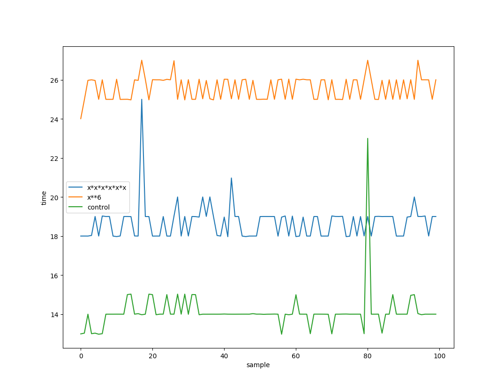

# Comptester

A simple python package to test the computation speed of different expressions.

- E.g., does `x*x*x*x*x*x` or `x**6` run faster?

## Contents

<!-- @import "[TOC]" {cmd="toc" depthFrom=1 depthTo=6 orderedList=false} -->

<!-- code_chunk_output -->

- [Comptester](#comptester)
  - [Contents](#contents)
  - [Installation](#installation)
  - [Usage](#usage)
  - [Example](#example)
  - [Example plot](#example-plot)

<!-- /code_chunk_output -->

## Installation

To install this package, run the [install](./install) script (or run the commands in your terminal).

## Usage

See the **Example** section below for an in-depth example for how to use this package.

- The `test` method will perform a test given two expressions, an iteration count, and a sample count.
- The `tprint` method will print the data from the test.
- The `plot` method will plot the data so you can see visually how the expressions compare against each other and a control.

## Example

```py
from comptester import tester

# Defining parameters
multiplication = "x*x*x*x*x*x"  # Compute x^6 by multiplication
power = "x**6"                  # Compute x^6 by power
iteration_count = 100000        # Number of times each expression is tested in a sample
samples = 100                   # Number of samples to collect

# Run the test and store it in the 'test' variable
test = tester.test(
    expr1=multiplication,
    expr2=power,
    iters=iteration_count,
    sample_count=samples,
)

# Print the test results to the console
# tester.tprint(test)

# Plot the test results
tester.plot(test)
```

## Example plot

The example code above produces the following plot:


